# 无处不在的 Agent

> **谁先把流程自动化，谁就先拿到规模优势。**

---

### 讨论：Agent 是什么？

<!-- .slide: data-transition="slide" -->

<strong>目标导向、多步执行、可调工具</strong>，在真实环境里把事往前推——不是单轮问完就结束。

<!-- 脉络参考：知乎专栏《AI Agent 智能体发展历史》等 -->

--

### Agent 发展史：四个时期

<!-- .slide: data-transition="fade" -->

<ol>
<li class="fragment fade-up"><strong>技术奠基（约 1950s–1990s）</strong> 符号主义、反向传播、早期机器人雏形——<strong>规则清楚</strong>的任务。</li>
<li class="fragment fade-up"><strong>专用智能体崛起（约 2000–2015）</strong> 工业机器人、Siri、推荐——<strong>场景固定</strong>、能力专用。</li>
<li class="fragment fade-up"><strong>大模型驱动（约 2016–2022）</strong> Transformer → GPT 系 → ChatGPT——<strong>理解与生成</strong>质变。</li>
<li class="fragment fade-up"><strong>智能体爆发（2023–）</strong> GPTs、多智能体、业务/端侧集成——<strong>任务链变长、人人可配</strong>。</li>
</ol>

--

### Agent 给工作带来的变化

<!-- .slide: data-transition="slide" -->

Cursor / Claude Code 等已普及：<strong>对话 + 读代码库 + 工具</strong>已是默认能力。

节奏上常见变化：更早做出<strong>能跑、能测</strong>的东西，用结果反推方案——人更多把精力放在<strong>取舍与体验</strong>上。

--

### 讨论：Agent 目前覆盖了你工作的哪些环节？

<!-- .slide: data-transition="zoom" -->

对照下面清单，看看<strong>还有哪些环节没用上 AI</strong>。

<ul>
<li class="fragment fade-up"><strong>需求</strong>：解读、拆任务、澄清边界、复述确认</li>
<li class="fragment fade-up"><strong>设计对齐</strong>：设计稿与思路、交互说明、设计走查准备</li>
<li class="fragment fade-up"><strong>技术 / 接口</strong>：契约、Mock、文档初稿、错误码与边界</li>
<li class="fragment fade-up"><strong>开发</strong>：脚手架、实现、重构、胶水代码、迁移脚本</li>
<li class="fragment fade-up"><strong>审查</strong>：CR 清单、风险点扫描、规范对照</li>
<li class="fragment fade-up"><strong>质量</strong>：用例设计、单测草稿、E2E / 浏览器回归、截图留证</li>
<li class="fragment fade-up"><strong>提测与交付</strong>：提测说明、风险项、changelog / 发布说明</li>
</ul>

---

### Agent 能力可以怎么扩展？

<!-- .slide: data-transition="slide" -->

<ul>
<li class="fragment fade-up"><strong>Rules</strong> ≈ <strong>行为准则</strong>：一开会话就扣上，防跑偏。</li>
<li class="fragment fade-up"><strong>Skills</strong> ≈ <strong>工具箱</strong>：平时揣着，对上活儿再拆开用。</li>
<li class="fragment fade-up"><strong>Tools / MCP</strong> ≈ <strong>伸出去的手</strong>：接浏览器、Git、设计稿……把环境里的反馈捞回会话。</li>
<li class="fragment fade-up"><strong>RAG</strong> ≈ <strong>agent的随身百科</strong>：翻书找资料的能力。</li>
</ul>

--

### 「MCP 已死」

<!-- .slide: data-transition="slide" -->

<ul>
<li class="fragment fade-up">最近讨论比较多的观点是「<strong>MCP 已死</strong>」，可参考：<a href="https://mp.weixin.qq.com/s/wyrxAZJHFxYZrJcyPbDmew" target="_blank" rel="noopener noreferrer">相关讨论</a>。</li>
<li class="fragment fade-up">提醒我们：<strong>别先一上来就摊子铺太大</strong>——默认约束、可挂载说明、<code>doc</code> 索引往往<strong>更便宜、先见效</strong>。</li>
<li class="fragment fade-up"><strong>MCP 仍是接外部能力的一条正路</strong>（长链路、存量系统、要稳定工具面时该用还用），争的是<strong>优先级和维护成本</strong>。</li>
</ul>

--

### 工具扩展：伸出去的手

<!-- .slide: data-transition="slide" -->

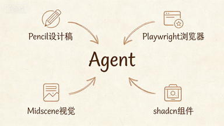

| 能力           | 典型工具                                       |
| :------------- | :--------------------------------------------- |
| **Pencil**     | 读稿、对稿                                     |
| **Playwright** | 点页面、截图                                   |
| **Midscene**   | Web 自动化 + **纯视觉**（可测**小程序、App**） |
| **shadcn**     | 组件库                                         |
| **git**        | git 自动处理                                   |

--

<!-- .slide: data-transition="slide" -->

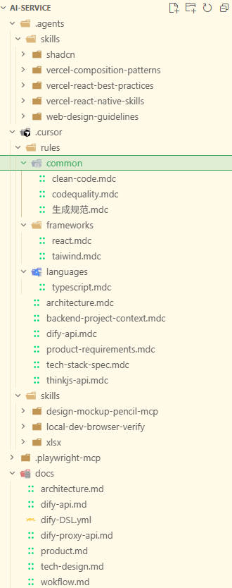

--

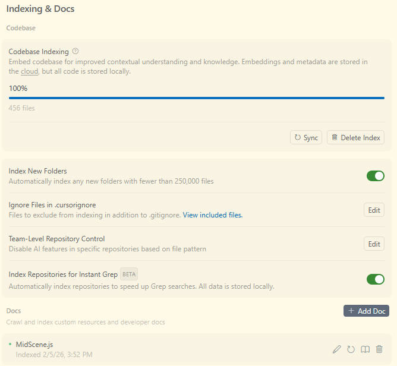

--

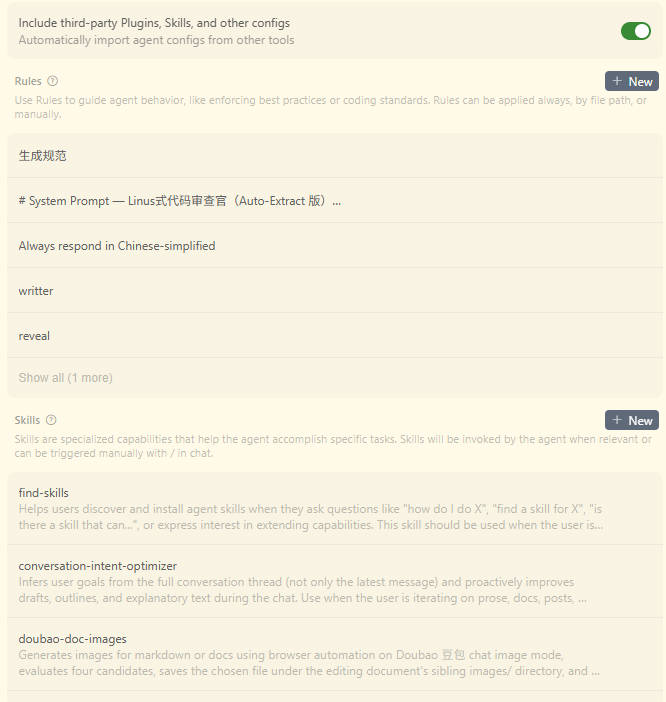

--

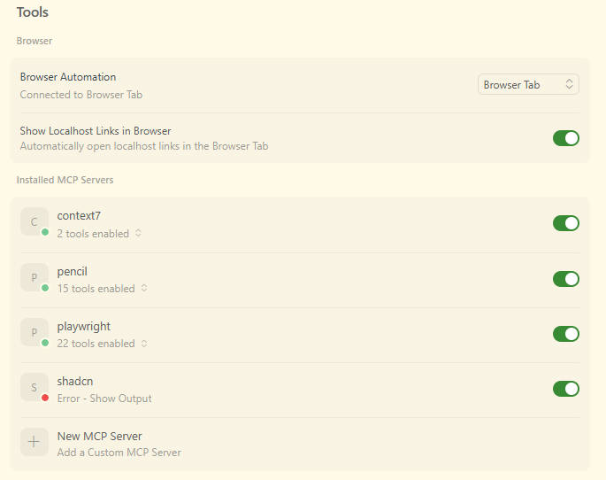

---

### 从一次完整迭代来看 Agent 可以覆盖的场景

<!-- .slide: data-transition="slide" -->

<ol>
<li class="fragment fade-up"><strong>减负</strong>：样板代码、胶水、清单初稿、对稿差异、用例草稿……能交给 Agent 的交给它。人主要盯<strong>取舍、体验和收口</strong>，少在重复劳动里耗神。</li>
<li class="fragment fade-up"><strong>提效</strong>：把<strong>主线</strong>上的迭代<strong>拆成六段</strong>——<strong>准备 → 开发 → 审查 → 对稿 → 自测 → 提测</strong>。输入尽量落在 <code>doc</code>，少来回问；开发段先出<strong>能跑、能测</strong>的首版，再迭代收紧。</li>
<li class="fragment fade-up"><strong>每段留可检查产物</strong>（清单、记录、脚本），方便人对账，也方便下一轮 Agent 接着干。<code>doc</code> 和仓库一起养，注释、文档、代码会越来越<strong>对齐</strong>，后面同一类事<strong>更省纠错时间</strong>。</li>
</ol>

--

### 1、准备阶段：先把 `doc` 写清楚

<!-- .slide: data-transition="slide" -->

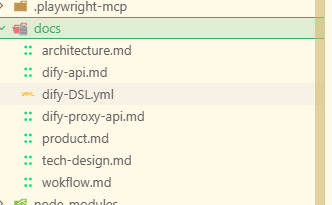

<strong><code>doc</code></strong> 产品 / 交互 / 接口 / 技术文档。<strong>改需求先改 <code>doc</code>，再动代码。</strong>

设计稿要<strong>能读、能和实现对上号</strong>。最好有现成的设计工具mcp接入

<code>doc</code> 越全，Agent 写注释、补文档、改代码时<strong>越少瞎编</strong>，后面才会越用越准。

--

### 2、开发：小步快跑，不指望一次到位

<!-- .slide: data-transition="slide" -->

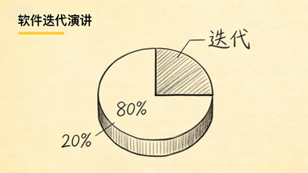

<ul>
<li class="fragment fade-up"><code>doc</code> 与设计稿对齐后，目标不再含糊；<strong>样板代码、胶水逻辑</strong>交给 Agent，人把精力放在<strong>边界条件与体验</strong>上。</li>
<li class="fragment fade-up">组件与样式优先跟<strong>既定组件库和规范工具链</strong>走，少堆手写杂糅；风格稳、仓库里的实现也更<strong>一致</strong>。</li>
<li class="fragment fade-up">首版做到 <strong>≈80%</strong>，细节后续逐步完成。</li>
</ul>

--

### 3、审查（质量）

<!-- .slide: data-transition="slide" -->

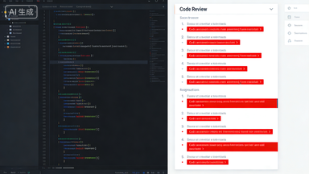

<ol>
<li class="fragment fade-up">对照团队<strong>约定与清单</strong>，关注风险点</li>
<li class="fragment fade-up">产出<strong>清单 + 建议</strong> → <strong>改 → 再过一轮</strong></li>
</ol>

--

### 4、对稿（质量）

<!-- .slide: data-transition="slide" -->

<ol>
<li class="fragment fade-up">设计 vs 浏览器，两边对照</li>
<li class="fragment fade-up">Agent 列出差异 → 收敛<strong>明显偏差</strong></li>
</ol>

--

### 5、自测（质量）

<!-- .slide: data-transition="slide" -->

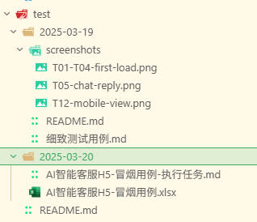

<ol>
<li class="fragment fade-up"><strong>用例</strong>：正常 / 异常 / 边界</li>
<li class="fragment fade-up"><strong>跑</strong>：Web 用 <strong>DOM 自动化</strong>（如 Playwright）。<strong>小程序、原生 App</strong> 或 DOM 不稳时，用 <strong>Midscene</strong> 一类走<strong>纯视觉</strong>更省事。</li>
<li class="fragment fade-up"><strong>留证</strong>：失败、截图、原因</li>
</ol>

脚本进仓库 → <strong>可复现</strong>

--

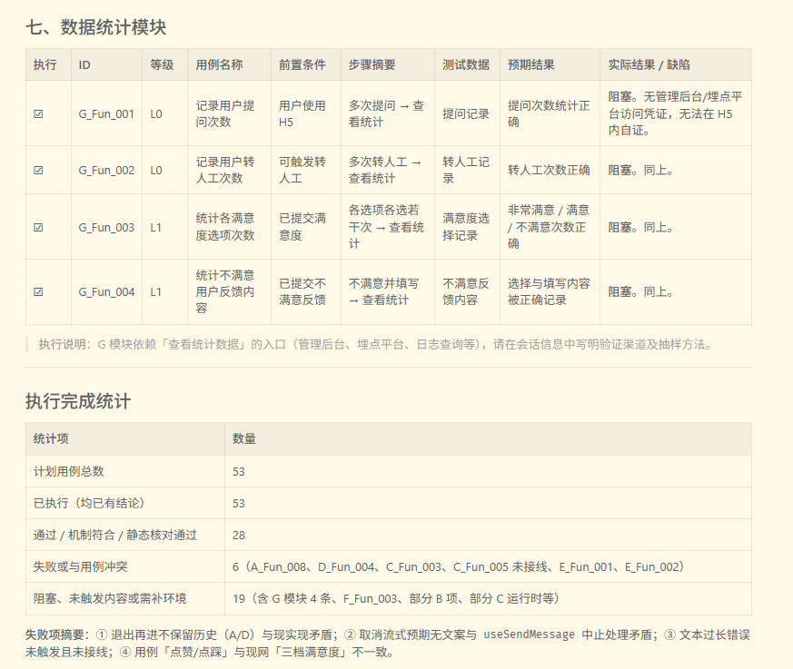

---

### 迭代要点

<!-- .slide: data-transition="concave" -->

|      块      | 记住                                                               |
| :----------: | ------------------------------------------------------------------ |
|   **准备**   | `doc` 写全、设计能对照、工具接上                                   |
|   **开发**   | 首版 ~80%，**流程每次都一样**                                      |
| **质量三关** | 每关 **留产物**，下一轮有据可依                                    |
|   **复利**   | `doc` 在养 + Agent 一直在用 → 注释文档代码 **对齐** → **越用越准** |

---

### 怎么让模型少「乱写」？

<!-- .slide: data-transition="fade" -->

<ul>
<li class="fragment fade-up"><strong>库 + 范例</strong>：给一套<strong>又窄又贴近真项目</strong>的写法，比写很长 rule 管用。</li>
<li class="fragment fade-up">约定和示例<strong>分开存</strong>。说明放进可检索的 <code>doc</code>，会话里<strong>指链接</strong>，别整段贴进上下文。</li>
<li class="fragment fade-up">直接使用成熟方案，减少现有生成</li>
</ul>

---

### Agent 还能帮我们做什么？

<!-- .slide: data-transition="slide" -->

不止写代码：<strong>材料、分享，任何多步骤操作</strong>都可以是工作流。

--

### 讨论 1、次抛工具成本几乎为 0

<!-- .slide: data-transition="slide" -->

临时要看数据、又不能给测试直连，怎么办？

在 <code>doc</code> 与会话上下文里<strong>字段、来源</strong>已经写清的前提下，做一页<strong>数据预览</strong>的边际成本<strong>几乎为零</strong>。

<!-- 配图待补：数据面板示意。你提供图片后，在此插入，例如： -->

--

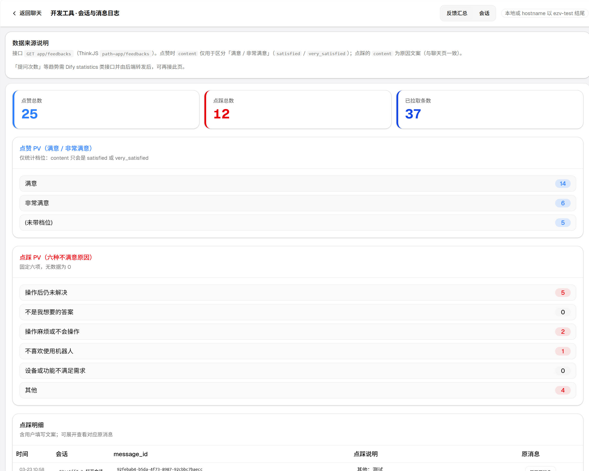

--

### 讨论 2：你会怎么写一份分享 PPT？

<!-- .slide: data-transition="slide" -->

<ul>
<li class="fragment fade-up"><strong>纯手工</strong>：大纲、逐页文案、配图与排版，全程自己搭。</li>
<li class="fragment fade-up"><strong>对话 AI + 人工拼接</strong>：分别让 AI 生成文字、生成配图，再<strong>手动复制粘贴</strong>进幻灯。</li>
<li class="fragment fade-up"><strong>Agent 接 API</strong>：把大模型、生图等 <strong>API</strong> 串进一条链路——<strong>文案与配图可一次到位</strong>，人只做校对与定稿。</li>
<li class="fragment fade-up"><strong>不接 API</strong>：用浏览器自动化<strong>模拟人工点击网页</strong>（如豆包生图），再下载、改文件，写回 Markdown / Reveal 或仓库。<strong>网页当接口</strong>，有时比先接 API 更快试。</li>
</ul>

--

### 讨论 3：Agent 时代，我们还能怎么做 RPA？

<!-- .slide: data-transition="slide" -->

<ul>
<li class="fragment fade-up"><strong>基于 DOM</strong>：Playwright 等脚本效率高、可维护</li>
<li class="fragment fade-up"><strong>基于视觉</strong>：<strong>Midscene</strong> 等，用<strong>纯视觉 + 语义</strong>，能做到 <strong>Web、小程序、App</strong> 自动化。界面老变、选择器不稳时，作主路或兜底都行。</li>
<li class="fragment fade-up"><strong>边界</strong>：Web 优先 DOM 脚本。纯视觉 + <strong>键鼠控制</strong> 辅助。</li>
</ul>

--

### 类比——纯视觉感知

<!-- .slide: data-transition="fade" -->

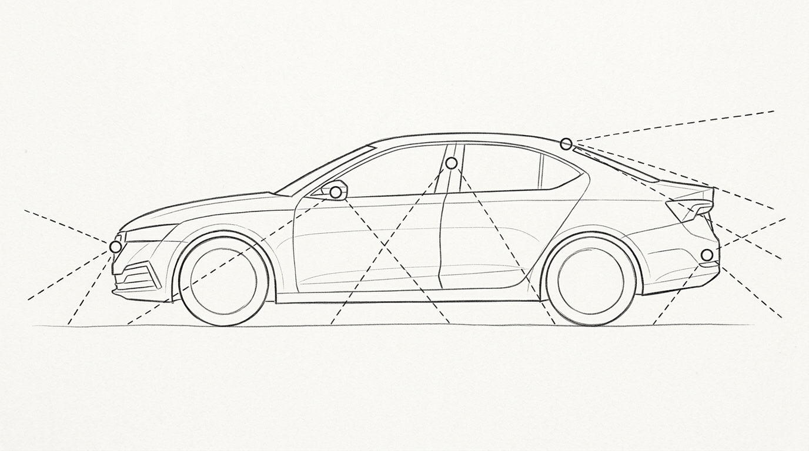

和车载「多路视觉 + 融合」类似：<strong>别只靠一种信号</strong>。RPA 里 DOM 和视觉<strong>一起用</strong>。

---

### 展望

<!-- .slide: data-transition="concave" -->

<ul>
<li class="fragment fade-up">各路资深个人经验会沉淀成<strong>skill</strong>，可流通、可交易</li>
<li class="fragment fade-up">许多岗位会从「每一步手搓」转向<strong>设计链路、盯产物、调组合</strong>。</li>
<li class="fragment fade-up">协作里传递的，会更常是<strong>可复用的打法与工具编排</strong>，而不只是一次对话的产出。</li>
<li class="fragment fade-up">当智能体与可组合能力成为常态，<strong>系统化的解题思路比零碎技巧更经得起时间</strong>。</li>
</ul>

---

### 会用 AI 和会用 Agent，差在哪？

<!-- .slide: data-transition="fade" -->

<ol>
<li class="fragment fade-up">会用 <strong>AI</strong> 的人：<strong>在提效</strong>。</li>
<li class="fragment fade-up">会用 <strong>Agent</strong> 的人：<strong>在替代流程</strong>。</li>
</ol>

---

### 从现在起，停止一切重复劳作！！

一切可标准化、可 SOP 化、低创造性、低人际博弈的工作内容，终将被 Agent 自动化、替代或大幅降本。

---

### 致谢

<!-- .slide: class="center" data-transition="fade" -->

谢谢大家
